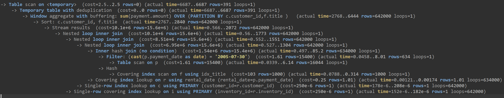

# Домашнее задание к занятию «Индексы» - Илларионов Дмитрий

### Задание 1

Напишите запрос к учебной базе данных, который вернёт процентное отношение общего размера всех индексов к общему размеру всех таблиц.

#### Решение:

```
-- Напишите запрос к учебной базе данных, который вернёт процентное отношение общего размера всех индексов к общему размеру всех таблиц.

select  sum(index_length) /sum(data_length) * 100 percent_of_indexes
from information_schema.tables
where TABLE_SCHEMA = 'sakila'
and data_length is not  NULL 
```

Результат:


### Задание 2

Выполните explain analyze следующего запроса:
```sql
select distinct concat(c.last_name, ' ', c.first_name), sum(p.amount) over (partition by c.customer_id, f.title)
from payment p, rental r, customer c, inventory i, film f
where date(p.payment_date) = '2005-07-30' and p.payment_date = r.rental_date and r.customer_id = c.customer_id and i.inventory_id = r.inventory_id
```
- перечислите узкие места;
- оптимизируйте запрос: внесите корректировки по использованию операторов, при необходимости добавьте индексы.

#### Решение

Выполняю:
```sql
explain analyze
select distinct concat(c.last_name, ' ', c.first_name), sum(p.amount) over (partition by c.customer_id, f.title)
from payment p, rental r, customer c, inventory i, film f
where date(p.payment_date) = '2005-07-30' and p.payment_date = r.rental_date and r.customer_id = c.customer_id and i.inventory_id = r.inventory_id
```
Запрос выполнился за 6 сек:


Результат:



Пробовал запускать несколько раз подряд - всегда за 6 сек выполняется запрос.

Пока  не понял, как по этому результату понять какие были операции и какая сколько заняла времени, и какая была их последовательность.

Вообще сложный и непонятный запрос, т.к. пока ни в лекциях ни в жизни ни разу не встречал про over и partition. Пришлось для начала это изучить. Изучил как доп. материал по видео:
https://www.youtube.com/watch?v=phIR9W0yIaE 
Теперь стало понятно что такое over и partition.

Далее была для меня новость, что можно брать данны есразу из нескольких таблиц без join и on, т.е. делать примерно так:

```sql
select * from таблица1, таблица2;
```
Не знал что будет на выходе, предполагаю - декартово произведение двух таблиц, типа cross join.

Пробую - изучаю на практике на простых таблицах - так и получилось предположение было верным:

- создал код:

```sql
create table t1(id int, name varchar(5) );
insert into t1 values (11, "1A");
insert into t1 values (12, "1B");
select * from t1;

-- DELETE from t1

create table t2(id int, name varchar(5) );
insert into t2 values (21, "2A");
insert into t2 values (22, "2B");
select * from t2;

```
t1:


t2:


Результат данные из двух таблиц:
```sql
select * from t1, t2;
```
- действительно получилось произведение:


Учитывая, что порядок испонения запросов такой:

```
1. FROM
2. ON
3. JOIN
4. WHERE
5. GROUP BY
6. WITH CUBE или WITH ROLLUP
7. HAVING
8. SELECT
9. OVER
10. DISTINCT
11. ORDER BY
```

- пробую перевести на русский язык - делаю разбор - что примерно делает движок БД при выполнении запроса (как я предполагаю):

```sql
select distinct concat(c.last_name, ' ', c.first_name), sum(p.amount) over (partition by c.customer_id, f.title)
from payment p, rental r, customer c, inventory i, film f
where date(p.payment_date) = '2005-07-30' and p.payment_date = r.rental_date and r.customer_id = c.customer_id and i.inventory_id = r.inventory_id
```

1. будем брать данные из указанных таблиц: payment p, rental r, customer c, inventory i, film f
2,3. - джойна в явном виде нет, но на выходи должно быть декартово произведение всех таблиц, это "ну очень много строк - и не сосчитаешь!".
4. Делается отбор по условиям:
4.1. date(p.payment_date) = '2005-07-30' - берется из таблицы p колонка payment_date вычисляется для нее  значение функции date - т.е. берем дату и проверяем не рано ли '2005-07-30' - если не равно - пропускаем, если равно - оставляем для последующей отработки и соединения с другими таблицами.
4.2 в других условиях: "and p.payment_date = r.rental_date and r.customer_id = c.customer_id and i.inventory_id = r.inventory_id" - тут просто из огромного количества строк после декартова произведения отфильтровываются и берутся только строки, удовлетворяющие этим условиям. 
5,6,7 - нет, пропускаем.
8. берется селект 
9. over - делается расчет значение по указанной партиции.
10. делается фильтр - показываются только уникальные значения.
11. нет.

##### Оптимизация запроса

1. Таблица f.title вообще не нужна - ее наличие или результаты в ней не влияют на результат. Данные из таблицы f.filme в итоге как бы не используются для.
Я попробовал скорректировал запрос на:

```sql
select distinct concat(c.last_name, ' ', c.first_name), sum(p.amount) over (partition by c.customer_id
-- , f.title
)
from payment p, rental r, customer c, inventory i, film f
where date(p.payment_date) = '2005-07-30' and p.payment_date = r.rental_date and r.customer_id = c.customer_id and i.inventory_id = r.inventory_id
```
- т.е. просто пока убрал таблицу f.title и запрос выполнился уже вместо 6 сек - 4 сек. 

При этом результат не поменялся - в  1 колонке как было до правки запроса, а во 2 колонке как после правки запроса:


Ужен немного с оптимизировали.

Далее, смотрим информацию о таблице:
```sql
describe payment; 
```
Получаем:


2. Отказаться от декартова произведения всех таблиц, а сделать простой join, модифицирую (убрал таблицу film):

```sql
explain analyze
select distinct concat(c.last_name, ' ', c.first_name), sum(p.amount) over (partition by c.customer_id)
from payment p 
join rental r on p.payment_date = r.rental_date
join customer c on r.customer_id = c.customer_id
join inventory i on  i.inventory_id = r.inventory_id
where date(p.payment_date) = '2005-07-30'
```

Результат данных - такой же:


Время выполнения сократилось до 18 мс:
 

Результат explain analyze:


3. можно попробовать добавить индекс что бы убыстрить выполнение поиска:

```sql
date(p.payment_date) = '2005-07-30'
```

Возможно полезно сделать индекс по этому полю.

Создал индекс:

```sql
CREATE INDEX idx_payment_date ON payment (payment_date);  
```


Пробую еще раз выполнить запрос:


Но, время почему-то даже увеличилось до 82 мс.

Пробовл еще много раз, время все равно не менее 74 мс.

Пробую удалить индекс:
```sql
ALTER TABLE payment DROP INDEX idx_payment_date;
```


Опять пробую запустить запрос - выполняется за 16 мс.
Т.е. индекс и не нужен такой - с ним еще хуже.
Предполагаю это потмоу, что мы сначала вычисляем значение функции date, а потом только сравниваем.

Тогда пробую индекс создать по "вычисляемому полю" (если так можно).

```sql
CREATE INDEX idx_payment_date ON payment (date(payment_date));  
```
Но, так нельзя:


Тогда "все вычисления date" как бы вынесем на сторону с чем сравниваем:

Опять делаю индекс:

```sql
CREATE INDEX idx_payment_date ON payment (payment_date);  
```

И правлю запрос так:

```sql
explain analyze
select distinct concat(c.last_name, ' ', c.first_name), sum(p.amount) over (partition by c.customer_id)
from payment p 
join rental r on p.payment_date = r.rental_date
join customer c on r.customer_id = c.customer_id
join inventory i on  i.inventory_id = r.inventory_id
where p.payment_date >= "2005-07-30" and p.payment_date < DATE_ADD("2005-07-30", INTERVAL 1 DAY);
```
Выполнение стало около 11 - 14 мс. чуть лучше, хоть и не на много. Возможно по тому, что сама таблица с платежами очень маленькая по современным меркам. И тут нет большой разницы - по индексу выходить или full scan делать всего столбца.
Результат анализа:


## Дополнительные задания (со звёздочкой*)
Эти задания дополнительные, то есть не обязательные к выполнению, и никак не повлияют на получение вами зачёта по этому домашнему заданию. Вы можете их выполнить, если хотите глубже шире разобраться в материале.

### Задание 3*

Самостоятельно изучите, какие типы индексов используются в PostgreSQL. Перечислите те индексы, которые используются в PostgreSQL, а в MySQL — нет.

*Приведите ответ в свободной форме.*


Типы индексов в psql:

https://postgrespro.ru/docs/postgresql/15/indexes-types?ysclid=lswviys3e640607591

11.2.1. B-дерево
11.2.2. Хеш
11.2.3. GiST
11.2.4. SP-GiST
11.2.5. GIN
11.2.6. BRIN

Типы индексов в MySQL:

1. Unique
2. primary key
3. simple, regular, or normal index
4. fulltext index
5. descending index

Детальнее разбираться пока не стал, т.к. пока нет на практике такой задачи и потребности.

---
